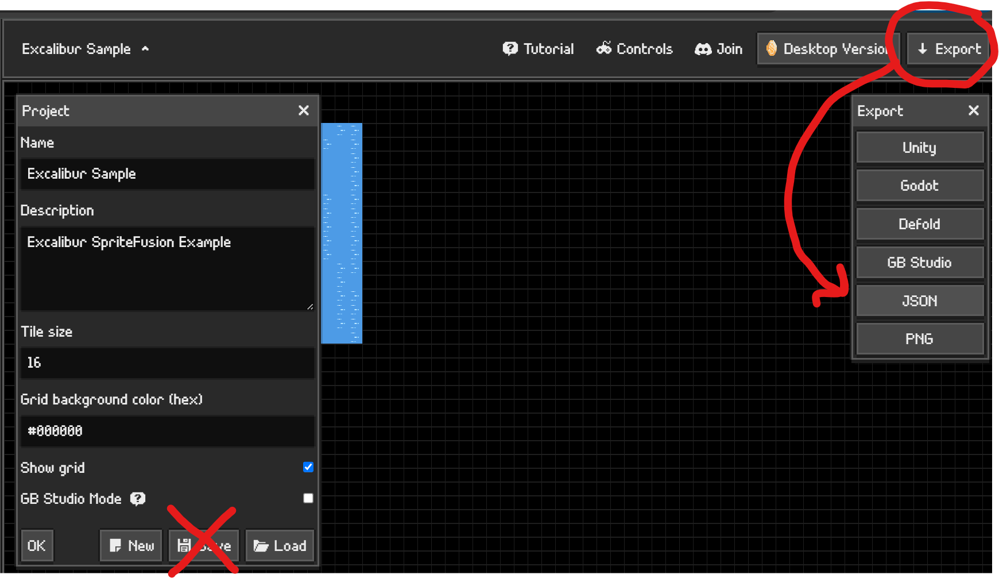
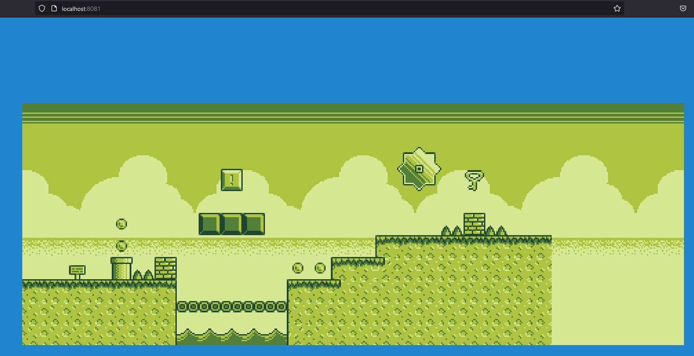
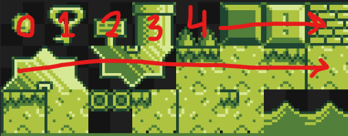
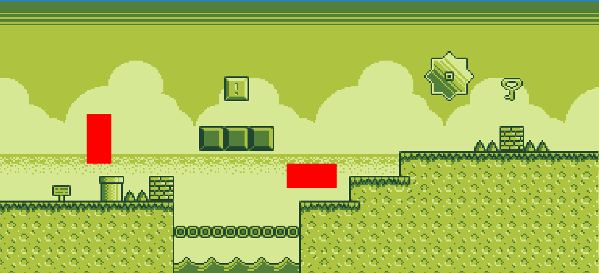

# Excalibur SpriteFusion Tile Map Plugin

This plugin supports the latest SpriteFusion data structure!

Sprite Fusion is a new lightweight Tilemap editor, check it out here https://www.spritefusion.com/editor

Export your map as `JSON`, **IMPORTANT** Do not use the "save" option in the current version of the plugin.



## Installation

```sh
npm install @excaliburjs/plugin-spritefusion
```

Create your resource, load it, then add it to your scene!

```typescript
const game = new ex.Engine({...});

const spriteFusionMap = new SpriteFusionResource({
    mapPath: './map/map.json',
    spritesheetPath: './map/spritesheet.png'
});

const loader = new ex.Loader([spriteFusionMap]);

game.start(loader).then(() => {
    spriteFusionMap.addToScene(game.currentScene);
});
```



Example using custom factories with tile id's.

```typescript
const spriteFusionMap = new SpriteFusionResource({
  mapPath: "./map/map.json",
  spritesheetPath: "./map/spritesheet.png",
  entityTileIdFactories: {
    0: props => {
      return new ex.Actor({
        pos: props.worldPos,
        width: 16,
        height: 16,
        color: ex.Color.Red,
        z: props.layer.order + 1,
      });
    },
  },
});
```

Specify the tile id according to this scheme, you can use this to select special tiles to run the factory.





## New API methods

```ts
    getSpriteById(tileId: string): Sprite | undefined
    getTileMap(layername: string): TileMap | undefined
```

- `getSpriteId`

  Using the string tileId from the SF json output, one can easiely extract the tile sprite from the resource

- `getTileMap`

  Using the layername string from the SF json output, one can get the Excalibur TileMap object from the resource

## NEW FEATURE - Sprite Fusion Tile Attributes!

Now in SpriteFusion (as of 10/20/2025), custom tile data is now available!

### Tile Attributes!!!!!


When you use SF you can add json data to a tile's location, and it shows up like this when the JSON is exported:

```json
{
  "tileSize": 16,
  "mapWidth": 30,
  "mapHeight": 12,
  "layers": [
    {
      "name": "ObjectLayer",
      "tiles": [
        { "id": "0", "x": 25, "y": 3, "attributes": { "entity": "bottle" } },
        { "id": "1", "x": 10, "y": 6, "attributes": { "entity": "mushroom" } },
        { "id": "5", "x": 4, "y": 4, "attributes": { "entity": "knight" } }
      ],
      "collider": false
    },
...
```

### How the plugin manages this

To leverage this, there are a couple new interface properties available in the API

```ts
    ...
    // in SpriteFusionResourceOptions interface
    /**
     * Callback to run when attributes are encountered
     */
    attributeCallback?: (attData: AttributeData) => void;
    /**
     * List of layer names to treat as object layers
     *
     */
    objectLayers?: string[];
```

and some new interfaces:

```ts
export interface TileData {
  id: string;
  x: number;
  y: number;
  attributes: any;
}

export interface AttributeData {
  tileData: TileData;
  mapData: SpriteFusionMapData;
}
```

### Attribute Callback

This property allows you to pass into the plugin a callback that let's you manually manage how you want the attribute data to be
handled.

In this example, i'm passing this function into the setup:

```ts
export const attributeCallback = (attData: AttributeData) => {
  const { tileData, mapData } = attData;
  const { attributes, x, y, id } = tileData;

  // do whatever you want with the data!!!!
};

const spriteFusionMap = new SpriteFusionResource({
  mapPath: "./src/SFmapData/map.json",
  spritesheetPath: "./src/SFmapData/spritesheet.png",
  attributeCallback: attributeCallback,
});
```

This can make using the attribute data easier. I've used it to create entities based off the tilemap data, and it can then be added to
the scene.

### Object Layers

When you are creating a SF map project, you might want to create a layer that has data embedded into it, but you don't want things
'drawn' as a tilemap layer by Excalibur.

Now you can add layernames into this array field, and the layer attributes gets parsed and the attribute callback gets called, but
nothing gets drawn to a layer.

Example:

```ts
const spriteFusionMap = new SpriteFusionResource({
  mapPath: "./src/SFmapData/map.json",
  spritesheetPath: "./src/SFmapData/spritesheet.png",
  attributeCallback: attributeCallback,
  objectLayers: ["ObjectLayer"],
});
```

```json
{
  "tileSize": 16,
  "mapWidth": 30,
  "mapHeight": 12,
  "layers": [
    {
      "name": "ObjectLayer",
      "tiles": [
        { "id": "0", "x": 25, "y": 3, "attributes": { "entity": "bottle" } },
        { "id": "1", "x": 10, "y": 6, "attributes": { "entity": "mushroom" } },
        { "id": "5", "x": 4, "y": 4, "attributes": { "entity": "knight" } }
      ],
      "collider": false
    },
```

None of the `ObjectLayer` gets drawn to a tilemap, but the information gets passed to the Attribute Callback.

## Documentation

For more information visit https://excaliburjs.com
